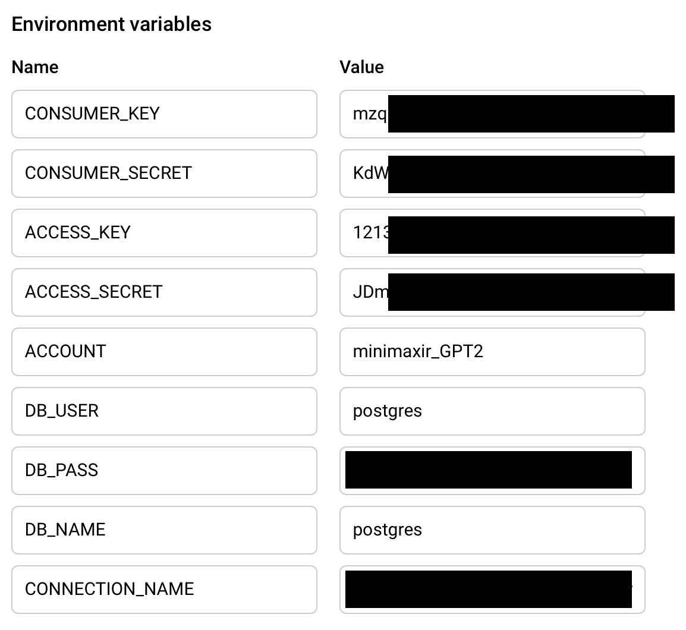

# twitter-cloud-run

A (relatively) minimal configuration app to run Twitter bots on a schedule using Google Cloud Run and Google Cloud Scheduler, making running the bot effectively free and can scale to effectively an unlimited number of bots if necessary.

There are two variants in their respective folders:

* `human_curated` : Uses a centralized Cloud SQL database to load pregenerated Tweets, and records if a tweet is generated. Recommended for AI tweet generation due to unpredictibility of AI-generated tweets.
* `gpt-2`: Uses an pretrained GPT-2 model, similar to the gpt2-cloud-run repo. (although the base `app.py` is built for `gpt-2-simple`, it's easy to hack it out and replace your own method of text generation for the bot.

Each folder has a `Dockerfile` and an `app.py` which runs the app in Cloud Run: you can build the container in Docker using `docker build .`, and upload it to Google Container Registry [with these instuctions](https://cloud.google.com/container-registry/docs/pushing-and-pulling).

## Usage

The app is configured using Environment Variables; this avoids hardcoding the access tokens within the container and therefore a security risk (encoding secrets in environment variables isn't the *ideal* solution for handling secrets in general, but it is sufficient for this app)

Additionally, you can specify a `REQUEST_TOKEN` as an Environment Variable, to prevent others from triggering the app accidentially (i.e. via random IP sniffing, as Cloud Run URLs are public).

See the READMEs in the folders for more pertinent information to the app.

## Setting Up A Twitter Bot

To run a Twitter bot, you need the `CONSUMER_KEY` and `CONSUMER_SECRET` for an app, and the `ACCESS_TOKEN` and `ACCESS_SECRET` corresponding to the user. Per recent Twitter antibotting changes, this has been made more difficult:

1. Create a Twitter app *on your human account*. You will have to go through a manual Twitter review.
2. In the App Settings, you'll see the `CONSUMER_KEY` and `CONSUMER_SECRET`.
3. Set up [Twurl](https://github.com/twitter/twurl) on your computer.
4. In a Terminal, run `twurl authorize --consumer-key <CONSUMER_KEY> --consumer-secret <CONSUMER_SECRET>` with the info above. It will give you a URL to approve an app; go to that URL *on your bot account* and approve the app. It will give you a PIN to input into the terminal.
5. Open the `~/.twurlrc` file, which will have thee `ACCESS_TOKEN` and `ACCESS_SECRET` you need for that account.

## Maintainer/Creator

Max Woolf ([@minimaxir](https://minimaxir.com))

*Max's open-source projects are supported by his [Patreon](https://www.patreon.com/minimaxir) and [GitHub Sponsors](https://github.com/sponsors/minimaxir). If you found this project helpful, any monetary contributions to the Patreon are appreciated and will be put to good creative use.*

## License

MIT

## Disclaimer

This repo has no affiliation with Twitter Inc.