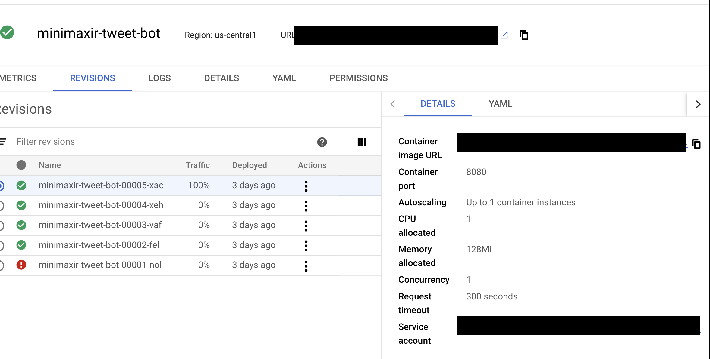
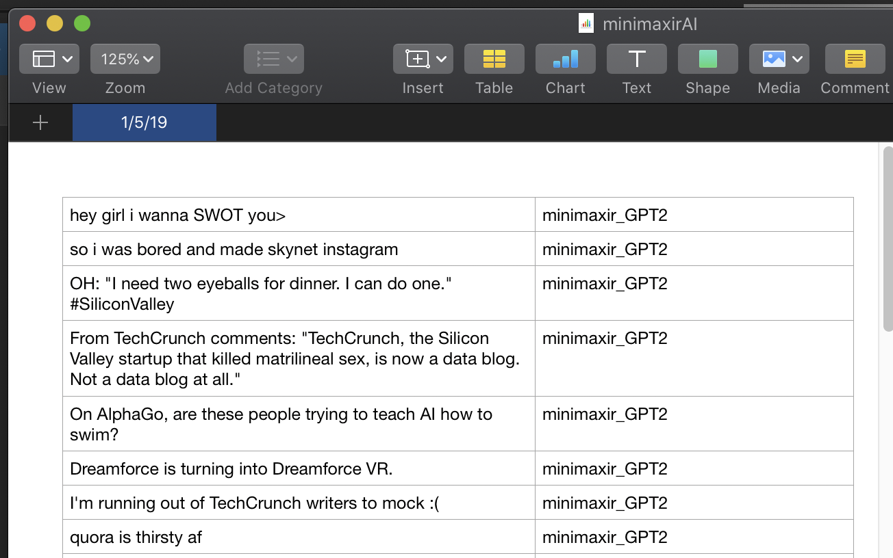
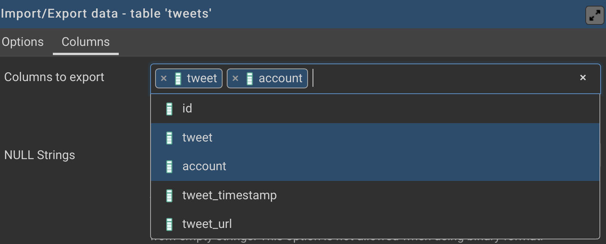

# human-curated

This folder contains an infrastructure linking together several Google Cloud Platform services together to allow a scalable amount of bots at the cost of maintaining only one persistant instance.

## Cloud Run

Cloud Run runs the container as a service with the provided environment variables. When the service is invoked, the `app.py` selects a random tweet from the provided `ACCOUNT`, tweets it to that account, and logs the tweet timestamp/URL in the database. The service takes a few seconds to boot/run.

The cost of running the container is effectively zero as it is live for only seconds.

## Cloud Scheduler

Sets up an external cron to trigger the bots. This can be set individually for each bot, can have set timezones, and can be edited if necessary.

## Cloud SQL

A PostgreSQL 11 database in [Cloud SQL](https://cloud.google.com/sql/docs/) which Cloud Run services can natively access. The minimal/cheapest config (1 vCPU, 0.6 GB RAM) is more-than-sufficient.

With [Cloud SQL Proxy](https://cloud.google.com/sql/docs/postgres/sql-proxy), the Cloud SQL instance can be easily accessed from the desktop via clients such as [pgAdmin](https://www.pgadmin.org).

## Database Schema

The database table schema is designed to minimize the amount of data saved to minimize costs. Multiple accounts can store pending tweets in a single table. 

The table has 5 columns:

* id (INT PK): row ID
* tweet (VARCHAR): Text to be used
* account (VARCHAR): Name of the Account the tweet corresponds to
* tweet_timestamp (TIMESTAMPZ): Timestamp of tweet (UTC)
* tweet_url (VARCHAR): Tweet URL

When running a service in Cloud Run, the script queries a random tweet from the database and account that hasn’t been tweeted yet. Once the tweet is made, the entry is updated with the timestamp and URL.

## Upload Data

A perk of this infrastructure is that more Tweets can be added by importing a spreadsheet (which is what you *should* be using to curate Tweets, as tweets can be multi line). The tweets can be curated one-per-cell-per-row. Once finished, another column with the account can be added, the spreadsheeet can be exported as a CSV.

Then you can use database import tools / PostgreSQL's `COPY` to import *only* the `tweet` and `account` columns.

## Costs 

Cloud Run: Effectively zero, since only charges on compute used.
Cloud Scheduler: Effectively zero, since cheap.
Cloud SQL: ~$7/mo for lowest DB config; oddly the most expensive part. Likely can be minimized if database instance is shut off when no tweets are expected. (e.g. if you only tweet at X:00, instance is up X:55 and shut down X:01, then costs will be about 1/10th)

## Notes

* Cloud Functions/Lambda is likely the more *canonical* implementation of such a bot vs. using a full Docker container in Cloud Run, but somehow using Cloud Run is easier.

## Future Development

* Moving everything to a single Kubernetes cluster (even with a single node) is likely more efficient, but may or may not be *easier* technically.
* Storing data in a Google Sheet may be better both for usability and cost; however the authentication method for a sheet (service account) [isn't the easiest thing to do](https://pygsheets.readthedocs.io/en/stable/authorization.html), and there is the possibility of accidentially corrupting the sheet.
